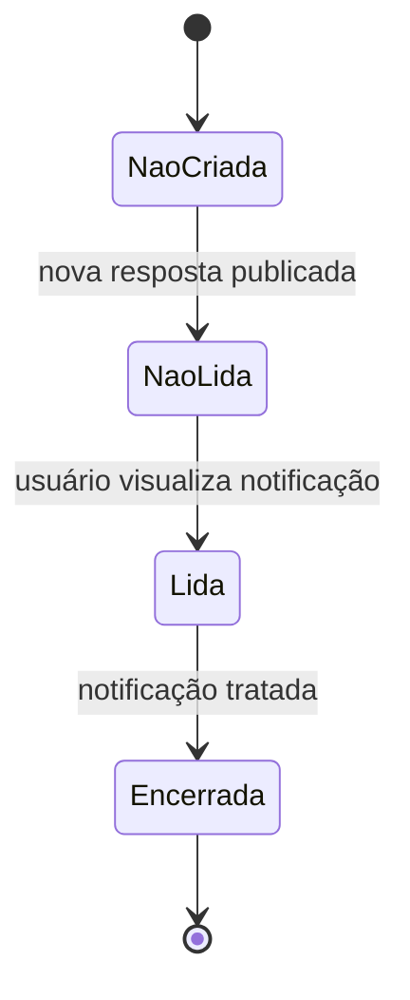

# Diagrama de Estados — Notificação de Nova Resposta

## 1. Objetivo

O diagrama de estados representa os diferentes estados que uma notificação pode assumir durante seu ciclo de vida no ESM Forum.

A notificação é criada quando uma nova resposta é publicada em uma pergunta pertencente ao usuário.

## 2. Estados

A notificação pode assumir os seguintes estados:

* **Não criada**: ainda não existe uma notificação relacionada à nova resposta.
* **Não lida**: a notificação foi criada, mas o usuário ainda não a visualizou.
* **Lida**: o usuário acessou a notificação.
* **Encerrada**: a notificação não possui mais uma ação pendente no fluxo considerado.

## 3. Transições

1. Uma nova resposta é publicada em uma pergunta.
2. O sistema cria uma notificação.
3. A notificação passa para o estado **Não lida**.
4. O usuário acessa suas notificações.
5. O usuário visualiza a notificação.
6. A notificação passa para o estado **Lida**.
7. Após o tratamento da notificação, ela pode ser considerada **Encerrada**.

## 4. Diagrama UML

## 5. Resultado esperado

Quando uma nova resposta é publicada em uma pergunta, o sistema deve criar uma notificação para o autor da pergunta.

A notificação inicialmente fica no estado **Não lida**. Quando o usuário visualizar a notificação, ela passa para o e
