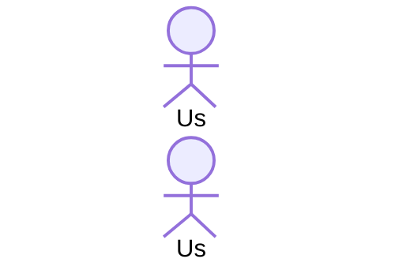

# Diagrama de Sequência — Receber Notificação de Nova Resposta

## 1. Objetivo

O diagrama de sequência representa a interação entre o usuário, o frontend, a API e o banco de dados durante o processo de publicação de uma resposta e geração de uma notificação para o autor da pergunta.

O fluxo corresponde ao caso de uso **"Receber notificação de nova resposta"**.

## 2. Participantes

* `:Usuario` — usuário que publica a nova resposta.
* `:Frontend` — interface utilizada para enviar a resposta.
* `:API` — responsável por processar a solicitação.
* `:Banco` — responsável por armazenar e consultar os dados.

## 3. Fluxo principal

1. O usuário acessa uma pergunta.
2. O usuário informa o texto da resposta.
3. O frontend envia a resposta para a API.
4. A API verifica se a pergunta existe.
5. A API consulta o banco de dados.
6. O banco retorna os dados da pergunta.
7. A API registra a nova resposta no banco.
8. O banco confirma o cadastro da resposta.
9. A API identifica o autor da pergunta.
10. A API cria a notificação para o autor.
11. O banco confirma o cadastro da notificação.
12. A API informa ao frontend que a operação foi concluída.
13. O frontend apresenta a confirmação ao usuário.

## 4. Diagrama UML

